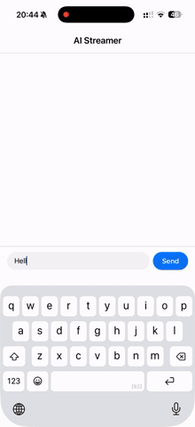

# Sneak Peek 👀


# AI Streamer - React Native Chat Challenge

A high-performance React Native chat application featuring real-time AI response streaming with advanced scroll management and markdown rendering.

## 🚀 Quick Start

### Prerequisites

- Node.js 18+ 
- npm or yarn
- Expo CLI (optional, comes with the project)

### Installation
```bash
# Clone the repository
git clone https://github.com/hernancasillas/ai-streamer
cd ai-streamer

# Install dependencies
npm install

# Start the development server
npm start
```

### Running the App

**Option 1: Expo Go (Recommended for quick testing)**
```bash
npm start
# Scan the QR code with Expo Go app (iOS/Android)
```

**Option 2: iOS Simulator (macOS only)**
```bash
npm run ios
```

**Option 3: Android Emulator**
```bash
npm run android
```

## 📱 Features Implemented

### Core Requirements
✅ Mock streaming engine with token-by-token rendering  
✅ Chat interface with scrollable message history  
✅ Intelligent auto-scroll with manual scroll detection  
✅ Keyboard handling with `KeyboardAvoidingView`  
✅ Clean, accessible UI with proper safe areas  

### Bonus Features
✅ **@shopify/flash-list** for optimal list performance  
✅ **React.memo** optimization to prevent unnecessary re-renders  
✅ **Stop generation** button to cancel streaming mid-sentence  
✅ **Markdown rendering** with code blocks, tables, and formatting  
✅ **Scroll-to-bottom button** that appears when scrolled up  
✅ **Custom hooks** for clean architecture (`useStreamingMessage`, `useAutoScroll`)  

### Streaming Simulation - Technical Approach

#### 🎯 Core Strategy

The streaming effect is achieved through a **recursive setTimeout pattern** rather than `setInterval`, providing precise control over the token emission rate.

#### Key Implementation Details

**1. Character-by-Character Emission**
```typescript
const streamNextToken = () => {
  if (indexRef.current < fullTextRef.current.length) {
    const nextChar = fullTextRef.current[indexRef.current];
    setStreamingContent(prev => prev + nextChar);
    indexRef.current++;
    timeoutRef.current = setTimeout(streamNextToken, STREAM_DELAY_MS);
  } else {
    setIsStreaming(false);
  }
};
```

**Why setTimeout recursion over setInterval?**
- **Precise timing control**: Each iteration schedules the next one AFTER execution completes
- **Clean cancellation**: Single `clearTimeout` stops the entire chain
- **Avoids call accumulation**: If JS thread is blocked, calls don't queue up
- **Flexibility**: Delay can be adjusted dynamically per token if needed

**2. Performance Optimization with useRef**
```typescript
const indexRef = useRef(0);           // Tracks position without re-renders
const fullTextRef = useRef('');       // Stores full text immutably
const timeoutRef = useRef<NodeJS.Timeout>(); // Cleanup reference
```

**Why useRef instead of useState for index?**
- `useState` triggers re-render on every change
- With 500 characters at 20ms intervals = 500 unnecessary re-renders
- `useRef` mutates without re-renders, keeping UI at 60fps
- Only `setStreamingContent` causes re-renders (which is necessary for display)

**3. State Management Flow**
```
User sends message
  ↓
chatStore.addUserMessage()
  ↓
Create AI message with unique ID (once)
  ↓
useStreamingMessage.startStream()
  ↓
Token loop: every 20ms
  ↓
chatStore.updateStreamingMessage(SAME_ID, newContent)
  ↓
Only AI message re-renders (React.memo on other messages)
  ↓
Auto-scroll follows IF user hasn't manually scrolled
```

**4. Idempotent Message Updates**
```typescript
// chatStore.ts
updateStreamingMessage: (id, content) => {
  const existingMessage = state.messages.find(m => m.id === id);
  
  if (existingMessage) {
    // UPDATE existing message (tokens 2-500)
    return { messages: state.messages.map(m => 
      m.id === id ? { ...m, content } : m
    )};
  } else {
    // CREATE new message (first token)
    return { messages: [...state.messages, newMessage] };
  }
}
```

This ensures one AI message grows rather than creating 500 separate messages.


### Custom Hooks Pattern

**Separation of Concerns:**
```
useStreamingMessage  → Business logic for streaming
useAutoScroll        → UI behavior for scrolling
ChatMessage          → Presentational component
MessageList          → Composition of hooks + UI
```

This architecture:
- ✅ Makes components testable in isolation
- ✅ Enables hook reusability across components
- ✅ Keeps components focused on single responsibility
- ✅ Simplifies debugging and maintenance


## 🎯 Edge Cases Handled

✅ **Spam Prevention**: Send button disabled during streaming  
✅ **Scroll Conflict**: Manual scroll pauses auto-scroll  
✅ **Memory Leaks**: Proper cleanup on component unmount  
✅ **Keyboard Overlap**: Different strategies for iOS/Android  
✅ **Long Messages**: FlashList handles 1000+ messages efficiently  
✅ **Rapid Scrolling**: Momentum scroll detection  
✅ **Mid-stream Stop**: Clean timeout cancellation  


## 🤝 Contact

**Developer**: Hernan Casillas  
**Email**: hernancasillas@gmail.com

---
